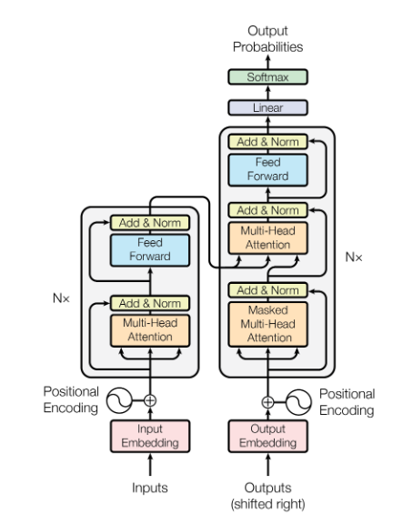
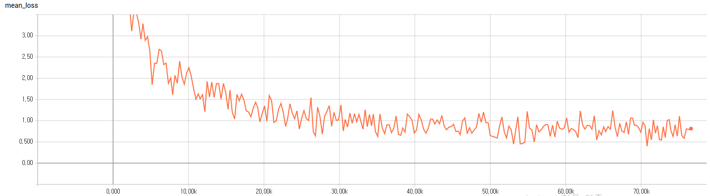
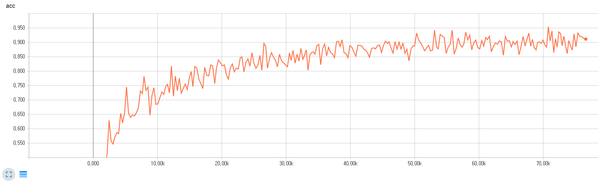

# Word Ordering: Can Neural Networks Put a Scramble of Words in Correct Order?

**I've found some critical bugs. Now I'm working on debugging.**

When learning a second language, one of the hardest challenges is likely to be familiar with the word order. Word order can be also important in machine translation because translation is, roughly speaking, a process that one arranges words of target language which are equivalent to source language in order. Probably you've done a word scramble game where you are to put shuffled words or letters in the original order. I think it's quite fun to see if neural networks can do it. Okay. Can you order the following words correctly?

**can translation machine order also important be word in**

## Requirements
  * NumPy >= 1.11.1
  * TensorFlow == 1.2 (Probably 1.3 should work, too, though I didn't test it)
  * matplotlib
  * distance
  * tqdm

## Model Architecture
I employ the Transformer which was introduced in the paper [Attention Is All You Need](https://arxiv.org/abs/1706.03762). It's known to the state-of-the-art model in the machine translation task as of 2017. However, I don't know if it fits in this task the best. Actually, I think a simpler architecture may work. The figure below is borrowed from the paper.

## File description
  * `hyperparams.py` includes all hyper parameters that are needed.
  * `data_load.py` contains functions regarding loading and batching data.
  * `modules.py` has all building blocks for encoder/decoder networks.
  * `train.py` contains the model and training code.
  * `eval.py` is for evaluation and inference.

## Training
* STEP 1. Download and extract [Leipzig English News 2015 1M Corpus](http://wortschatz.uni-leipzig.de/en/download).
* STEP 2. Adjust hyper parameters in `hyperparams.py` if necessary.
* STEP 3. Run `train.py` or download the [pretrained files](https://www.dropbox.com/s/5axxz6f9g93ms72/logdir.zip?dl=0).

## Training Loss and Accuracy
* Training Loss

* Training Accuracy

## Evaluation
  * Run `eval.py`. 

We take WER (Word Error Rate) as the metric. WER is computed as follows:

WER = Edit distance / Number of words

**Total WER : 5530/23541=0.23**

Here are some of the evaluation results. Details are available in the `results` folder.

Inputs  : another this step development that is in 
Expected: is this another step in that development 
Got     : that that another step in that development 
WER     : 2

Inputs  : time we're remember going a long to for this 
Expected: we're going to remember this for a long time 
Got     : we're going to remember this for a long time 
WER     : 0

Inputs  : retail a at look concepts for ahead up-and-coming click spinoff 
Expected: for a look at up-and-coming spinoff retail concepts click ahead 
Got     : the this retail at this concepts click click click ahead 
WER     : 7

Inputs  : comfort daughter his is -year-old 
Expected: comfort is his -year-old daughter 
Got     : his is his -year-old daughter 
WER     : 1

Inputs  : solar are tumbling prices everywhere 
Expected: everywhere solar prices are tumbling 
Got     : solar solar prices are about 
WER     : 2

Inputs  : googles percent hispanic black percent employees were and percent female 
Expected: googles employees were percent female percent black and percent hispanic 
Got     : now female were percent and black and and percent hispanic 
WER     : 5

Inputs  : to asked proposed for the survey name change responses the 
Expected: the survey asked for responses to the proposed name change 
Got     : the proposed asked the the to change proposed name change 
WER     : 4

Inputs  : certain to already laid the have foundations been degree a 
Expected: to a certain degree the foundations have already been laid 
Got     : the have certain degree the foundations have already been laid 
WER     : 2

Inputs  : much very i like her 
Expected: i like her very much 
Got     : i like her very much 
WER     : 0

Inputs  : them out without completely he have might them writing conceived 
Expected: he might have conceived them without writing them out completely 
Got     : he might have them them out completely completely completely completely 
WER     : 5

Inputs  : to darkness in the feet she his at seemed slump 
Expected: in the darkness at his feet she seemed to slump 
Got     : she the this she feet feet she seemed to the 
WER     : 5

Inputs  : to back to work monday got 
Expected: got to back to work monday 
Got     : got to work to work monday 
WER     : 1

Inputs  : the seeds some gather of could you also 
Expected: you could also gather some of the seeds 
Got     : you could also gather some of the how 
WER     : 1

Inputs  : likely some to answer time to that's take 
Expected: that's likely to take some time to answer 
Got     : that's likely to take some time to answer 
WER     : 0

Inputs  : grip italy ever will mafia on its loosen 
Expected: will mafia ever loosen its grip on italy 
Got     : italy italy italy no its a on italy 
WER     : 5

Inputs  : have that would into story he the said turned 
Expected: that would have turned into the story he said 
Got     : that would have turned into the story he said 
WER     : 0

Inputs  : it together we and done have 
Expected: and we have done it together 
Got     : and we have done it together 
WER     : 0

Inputs  : his tuesday team there on headed 
Expected: his team headed there on tuesday 
Got     : on team headed there on tuesday 
WER     : 1

Inputs  : sullivan loyola and long beth gone were marshall 
Expected: loyola sullivan and beth marshall were long gone 
Got     : said and marshall long marshall were long gone 
WER     : 4

Inputs  : are no options other there 
Expected: there are no other options 
Got     : there are no other options 
WER     : 0

Inputs  : ice the player best on 
Expected: best player on the ice 
Got     : best player on the ice 
WER     : 0

Inputs  : when own but not so youre much your on 
Expected: but when youre on your own not so much 
Got     : youre youre youre not your own so so much 
WER     : 4

Inputs  : parents accountable held that's it are to and be 
Expected: parents are to be held accountable and that's it 
Got     : that's are to be held accountable and that's it 
WER     : 1

Inputs  : larger market share than that in is but percent 
Expected: but that market share is percent larger than in 
Got     : but that market is is percent larger than in 
WER     : 1

Inputs  : trying increase theyre to scoring 
Expected: theyre trying to increase scoring 
Got     : theyre trying to increase scoring 
WER     : 0

Inputs  : this now easiest is the of the one four 
Expected: now this is the easiest one of the four 
Got     : this this is the the of of the four 
WER     : 3

Inputs  : shot jackson samuels broke and was cross his saved from 
Expected: jackson broke and from his cross samuels shot was saved 
Got     : jackson was from was his cross was was was saved 
WER     : 5

Inputs  : steps always whenever eaton it onto the track is 
Expected: it always is whenever eaton steps onto the track 
Got     : whenever is steps the onto steps onto the track 
WER     : 5

Inputs  : the said billion goals requires its reach bolden program to 
Expected: the program requires billion to reach its goals bolden said 
Got     : the program requires its to reach its goals is said 
WER     : 2

Inputs  : with he like it's said gas cooking 
Expected: it's like cooking with gas he said 
Got     : it's like cooking with gas he said 
WER     : 0

Inputs  : foggy issue is the 
Expected: the issue is foggy 
Got     : the issue is is 
WER     : 1

Inputs  : him everybody knew second-hand 
Expected: everybody knew him second-hand 
Got     : everybody knew him people 
WER     : 1

Inputs  : time the is now 
Expected: the time is now 
Got     : now time is now 
WER     : 1

Inputs  : what mean i you know 
Expected: you know what i mean 
Got     : you know what i mean 
WER     : 0

Inputs  : look we're a company big 
Expected: look we're a big company 
Got     : we're we're a big company 
WER     : 1

Inputs  : of howard regarded them many ryan 
Expected: many of them regarded ryan howard 
Got     : ryan of them had ryan howard 
WER     : 2

Inputs  : unfair double these standard create an standards could 
Expected: could these standards create an unfair double standard 
Got     : could these an create an unfair double standard 
WER     : 1
